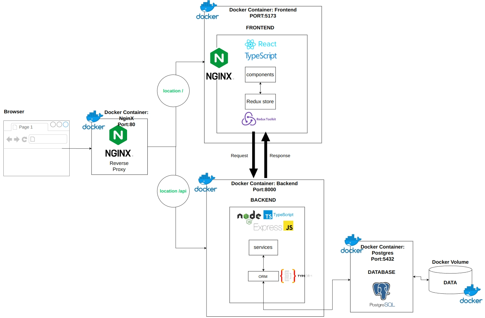
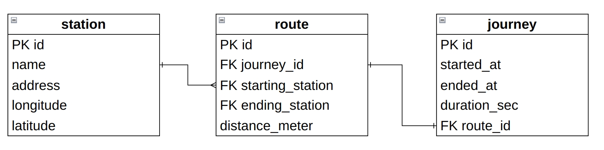

# HSL City Bike

Using the [open data](https://www.hsl.fi/en/hsl/open-data) from Helsinki Region Transport(HSL), the app helps to check bike journeys and stations data from HSL with filters and sorts.

# Technologies

- Frontend: React, TypeScript, Redux, TailwindCSS, Vite,
- Backend: Node, Express, Typescript, TypeORM
- Database: PostgreSQL, PgAdmin
- Etc: Docker, NginX

# Software Architecture (in production)

<p align="center">
  
</p>

In development, Nginx attached to the frontend (on the picture above) does not exist.

# Features

- [x] Responsive

## Journeys page

- [x] List the journeys with pagination
- [x] Search journeys by station names
- [x] Filter journeys by setting the range of duration and distance
- [x] Order the list of journeys by columns (departure station, return station, duration and distanace)

## Station page

- [x] List all stations with pagination
- [x] Search a station by station name
- [x] Mark all stations on a map
- [x] Display station id and address on popup on a map when a bike station is clicked.

## Station detail page

Display the following information related to the station

- [x] The average distance of a journey starting from the station
- [x] The average distance of a journey ending at the station
- [x] Top 5 most popular return stations for journeys starting from the station
- [x] Top 5 most popular departure stations for journeys ending at the station

## Add station page

- [x] New bike station can be added through UI and the data is stored in DB.

# Development Process

0. UI and UX design
1. Data normalization
2. Convert CSV to SQL
3. API implementation
4. Frontend Development
5. Frontend testing
6. Dockerizing and Nginx configuation
7. Data backup
8. Deployment:

- server configuration
- data restoration
- running the app,
- setup connection between IP and hostname

# UI design

<iframe style="border: 1px solid rgba(0, 0, 0, 0.1);" width="800" height="450" src="https://www.figma.com/embed?embed_host=share&url=https%3A%2F%2Fwww.figma.com%2Ffile%2FcGs80txWEyb9LjOrglHZXC%2FConvertify-Sketch%252FAdobe%252FGoogle-(Community)%3Fnode-id%3D1%253A2%26t%3DHXk12AmQMAAq5Ud3-1" allowfullscreen></iframe>

# Data modeling

<p align="center">
  
</p>

- Route, Journey: 3128759 rows in each table

- Station: 460 rows

# Docker for development and production

## Development:

```docker
#### 1. Frontend: /client/Dockerfile.dev ####
# Build image from node
FROM node:20-alpine
# Working directory in Docker
WORKDIR /app
# Copy the package.json from the current location
# and paste to the working directory /app
COPY package.json /app
# Run the npm cli in Docker container
RUN npm install
# Copy source code from the current location
# to the /app dir in Docker
COPY . .
# Expose the port # 5173
EXPOSE 5173
# Start the React development server in Docker
CMD ["npm", "run", "dev"]
```

```docker
#### 2. Backend: /server/Dockerfile ####
# Three stages: base, development and production

# Base stage
# Build imagae from node
FROM node:20-alpine as base
# Create working directory in Docker
WORKDIR /app
# Copy package.json and package-lock.json from the current location
# and paste to the working dir in Docker
COPY package*.json /app
# Expose the port #8000
EXPOSE 8000

# Development stage
FROM base as development
ENV NODE_ENV=development
RUN npm install
COPY . .
RUN npm run build

# Production stage
# Skip and explain in production chapter below.
# FROM base as production
# ENV NODE_ENV=production
# RUN npm ci --only=production
# COPY --from=development /app/dist ./dist
# CMD ["node","dist/index.js"]


```

## Production

# Challenges

## Volume mounting to Postgres container

- I worked on Mac OS when trying to mount Docker volume to Postgres container.

## Nginx configuration

-

## Table joint

## Redux architecture setup

# Future Improvement

- Add api test code in the server
- Implement AddJouney page
- Integrate Docker to CI CD

# 3. Run locally

## Prerequisit:
