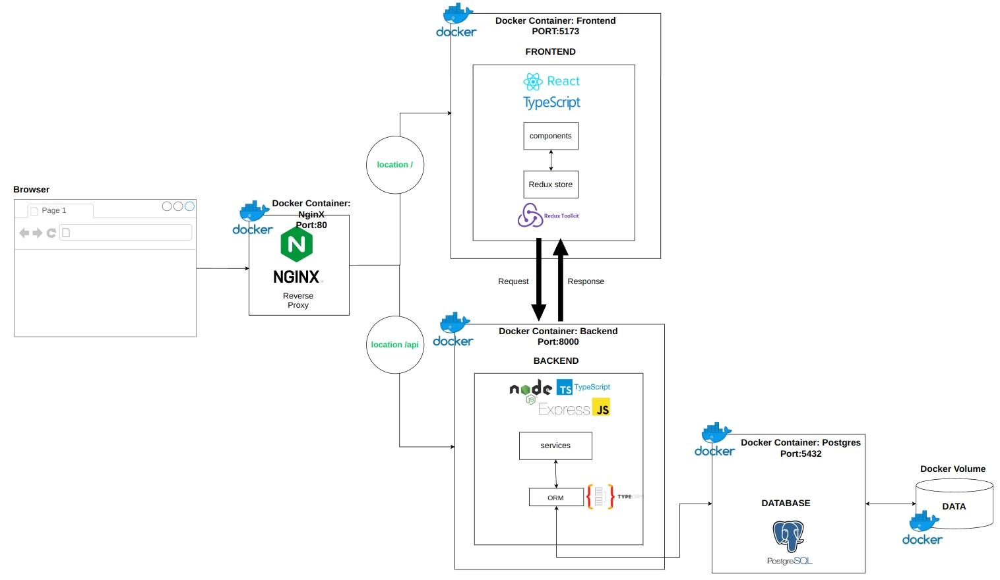
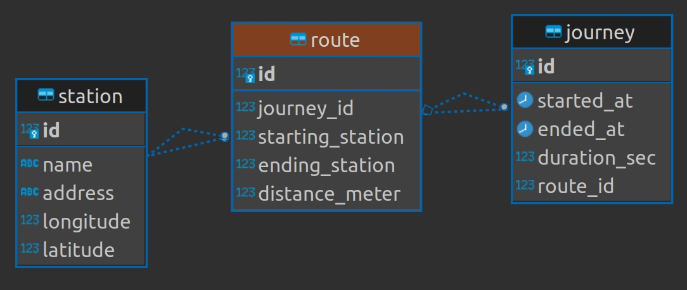

# HSL City Bike - The project is under the production process.

Using the [open data](https://www.hsl.fi/en/hsl/open-data) from Helsinki Region Transport(HSL), the app helps to check bike journeys and stations data from HSL with filters and sorts.

# Technologies
<<<<<<< Updated upstream

- Frontend: React, TypeScript, Redux, TailwindCSS, Vite,
- Backend: Node, Express, Typescript, TypeORM
- Database: Postgres,
- Etc: Docker

# Architecture

=======

- Frontend: React, TypeScript, Redux, TailwindCSS, Vite,
- Backend: Node, Express, Typescript, TypeORM
- Database: Postgres,
- Etc: Docker

# Software Architecture

<p align="center">
  
</p>

>>>>>>> Stashed changes
# TODO: add!

# Features

## Journeys page

- [x] List the journeys with pagination
- [x] Search journeys by station names
- [x] Filter journeys by setting the range of duration and distance
- [x] Order the list of journeys by columns (departure station, return station, duration and distanace)

## Station page

- [x] List all stations with pagination
- [x] Search a station by station name
- [x] Mark all stations on a map
- [x] Display station id and address on popup on a map when a bike station is clicked.

## Station detail page

Display the following information related to the station

- [x] The average distance of a journey starting from the station
- [x] The average distance of a journey ending at the station
- [x] Top 5 most popular return stations for journeys starting from the station
- [x] Top 5 most popular departure stations for journeys ending at the station

## Add station page

- [x] New bike station can be added through UI and the data is stored in DB.

# Development Process

0. UI and UX design
1. Data normalization
2. Convert CSV to SQL
3. API implementation
4. Frontend Development
5. Frontend testing
6. Dockerizing

<iframe style="border: 1px solid rgba(0, 0, 0, 0.1);" width="800" height="450" src="https://www.figma.com/embed?embed_host=share&url=https%3A%2F%2Fwww.figma.com%2Ffile%2FcGs80txWEyb9LjOrglHZXC%2FConvertify-Sketch%252FAdobe%252FGoogle-(Community)%3Fnode-id%3D1%253A2%26t%3DHXk12AmQMAAq5Ud3-1" allowfullscreen></iframe>

# 2. Relational database structure

<p align="center">
  
</p>

# Why Docker?

# Challenges

## Running Postgres container in Docker

## Setting up Nginx

##

# Future Improvement

<<<<<<< Updated upstream
## Add test code in the server

##
=======
- Add api test code in the server
-
>>>>>>> Stashed changes

# 3. Run locally

## 3-1 Frontend

```sh
$ cd client
$ docker build --tag hsl-client .
$ docker run -dp 127.0.0.1:5173:5173 hsl-client
```
