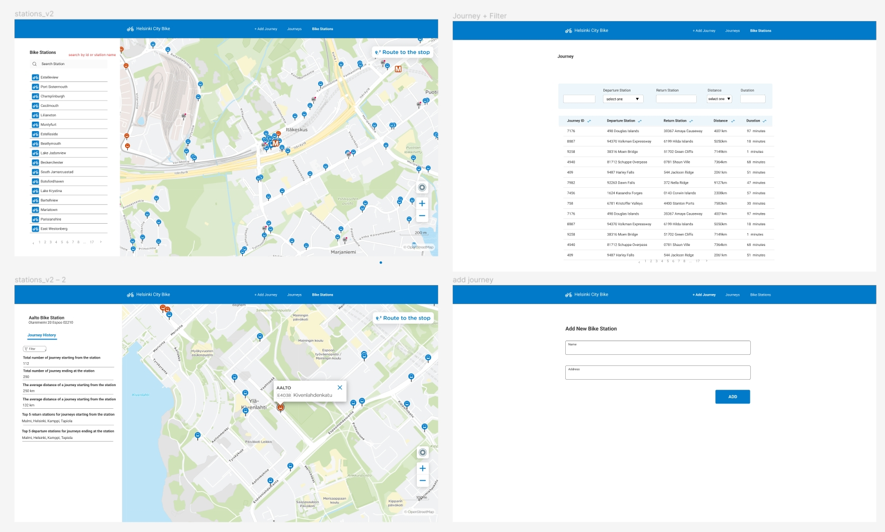

# HSL City Bike

Using the [open data](https://www.hsl.fi/en/hsl/open-data) from Helsinki Region Transport(HSL), the app helps to check bike journeys and stations data from HSL with filters and sorts.

# Live on [here](http://octoxy.ddns.net:50024/)

# Technologies

- Frontend: React, TypeScript, Redux, TailwindCSS, Vite, (Vitest, Jest: currently working on)
- Backend: Node, Express, Typescript, TypeORM
- Database: PostgreSQL, PgAdmin
- Etc: Docker, NginX, Leaflet-OpenStreetMap API

# Software Architecture (in production)

<p align="center">
  
</p>

In development, Nginx attached to the frontend (on the picture above) does not exist.

# Features

- [x] Responsiveness

## Journeys page

- [x] List the journeys with pagination
- [x] Search journeys by station names
- [x] Filter journeys by setting the range of duration and distance
- [x] Order the list of journeys by columns (departure station, return station, duration and distanace)

## Station page

- [x] List all stations with pagination
- [x] Search a station by station name
- [x] Mark all stations on a map
- [x] Display station id and address on popup on a map when a bike station is clicked.

## Station detail page

Display the following information related to the station

- [x] The average distance of a journey starting from the station
- [x] The average distance of a journey ending at the station
- [x] Top 5 most popular return stations for journeys starting from the station
- [x] Top 5 most popular departure stations for journeys ending at the station

## Add station page

- [x] New bike station can be added through UI and the data is stored in DB.

# Development Process

0. UI and UX design
1. Data normalization
2. Convert CSV to SQL
3. API implementation
4. Frontend Development
5. Frontend testing
6. Dockerizing and Nginx configuation
7. Data backup
8. Deployment:

- server configuration
- data restoration
- running the app,
- setup connection between IP and hostname

# UI design

See in [Figma](https://www.figma.com/file/cGs80txWEyb9LjOrglHZXC/city-bike?type=design&node-id=1%3A2&mode=design&t=K9S2aKbJHW7WKsTx-1)

<p align="center">
  
</p>

# Data modeling

<p align="center">
  
</p>

# Docker

It's been hard to find right Docker resources that cover the needs of this project. This is the note for future myself anyone anyone who is looking for Docker configuration reference for the following cases.

- You want to set up Docker for development and production environment.
- Your app is fullstack built with React, Typescript, Node, Express, Postgres, and (TypeORM)
- You want to use Docker named volumes to persist Postgres data
- You have a problem to connect to Postgres DB in Docker container.

  _I implemented the app without docker development environment. After checking the app fully operational, then I moved to set up dockerizing process. Therefore, if you want to start to set up docker dev environment first, the working process written on this section may be different._

## Development

### Work Process

<p align="center">
  
</p>

**NOTES**

- The process #1: PgAdmin desktop is used to backup the normalized data
- The process #2: In `docker-compose-dev.yml`, the following codes are relevant to the process.

```yaml
  postgres:
    image: postgres:latest
    container_name: hsl-postgres
    restart: always
    environment:
      <<: *common-variables
      POSTGRES_DB: $DB_NAME
      POSTGRES_USER: $DB_USERNAME
      POSTGRES_PASSWORD: $DB_PASSWORD
    ports:
      - "5432:5432"
    volumes:
      - hsldata:/var/lib/postgresql/data
```

- The process #3: Nginx reverse proxy config is in `./client/nginx/default.conf`
- The process #5: In `/server/src/db/data-source.ts` , the argements passed to DataSource has changed from

```javascript
export const AppDataSource = new DataSource({
  type: "postgres",
  host: process.env.DATABASE_HOST,
  port: 5432,
  username: process.env.DATABASE_USERNAME,
  password: process.env.DATABASE_PASSWORD,
  database: process.env.DATABASE_NAME,
  entities: [Station, Route, Journey],
});
```

to

```javascript
export const AppDataSource = new DataSource({
  type: "postgres",
  url: `postgres://${process.env.DB_USERNAME}:${process.env.DB_PASSWORD}@${process.env.DB_DOCKER_SERVICE_NAME}:${process.env.DB_PORT}/${process.env.DB_NAME}`,
  synchronize: true,
  entities: [Station, Route, Journey],
});
```

- The process #6: API URLs are changed in `/client/src/api/JourneyAPI.ts` and `/client/src/api/StationAPI.tsx` Read comments in the files.

## Production

<p align="center">
  
</p>

**NOTE**

- Dockerfile and all configs are used in the production phase.
- Process #7: Add `default.conf` in `/client/nginx` to serve the app in browsers.
- Process #8: Create `docker-compose.yml` in the root directory

## Docker Reference

[English]

- Docker hands-on exercise: https://docs.docker.com/get-started/
- Docker volume vs bind mounts: https://docs.docker.com/storage/
- Docker fullstack for dev and prod: https://gitlab.com/codeching/docker-multicontainer-application-react-nodejs-postgres-nginx-basic
- Docker fullstack for dev: https://github.com/daniil/full-stack-js-docker-tutorial
- Database URL after dockerizing: https://stackoverflow.com/a/33363660

[Korean]

- Docker and Posgres: https://shawn-dev.oopy.io/4a432950-75eb-464a-b8b8-61265123c699
- Docker volume and network: https://tech.cloudmt.co.kr/2022/06/29/%EB%8F%84%EC%BB%A4%EC%99%80-%EC%BB%A8%ED%85%8C%EC%9D%B4%EB%84%88%EC%9D%98-%EC%9D%B4%ED%95%B4-2-3-%EB%B3%BC%EB%A5%A8%EA%B3%BC-%EB%84%A4%ED%8A%B8%EC%9B%8C%ED%81%AC/
- Docker fullstack app: https://github.com/jaewonhimnae/docker-codes

# Challenges

- **Data normalization**: Handling over 3 millions of rows and working with constraints on the way of learning Postgres was a demanding and slow process.
- **Docker and Nginx** : Every single configuration should be correct in order to make the app up and running. It took time to figure out 1. WHY docker and nginx do not work. and 2. HOW to find WHY. Definitely need to expand my understanding in Linux.
- **Docker volume**: Mounting docker volume to postgres container in MacOS was problematic.

# Future Improvement

- [ ] Handle fallback (404 and 502 pages)
- [ ] Add test code on the server side
- [ ] Implement AddJouney page
- [ ] Integrate Docker to CI CD
- [ ] Deploy with SSL certificate

# Run locally

## Prerequisit:

- [ ] Install Docker Engine, PostgreSQL, PgAdmin, Node in your machine.
      [See how to install Docker Engine on Ubuntu](https://docs.docker.com/engine/install/ubuntu/)
- [ ] Copy `.env.example` file in the root directory and rename it as `.env`. Change values in the file.
- [ ] Open the terminal

```
$ cd path-to-the-project-directory
$ docker-compose -f docker-compose-dev.yml up --build
```

- [ ] Download [the folder](https://metropoliafi-my.sharepoint.com/:f:/g/personal/chaeahp_metropolia_fi/Egq9M_hHMKNJsbhSqb5Sa0cBZC2CdGdP0jGgf2RuDud7Yg?e=kmH9NZ) and upzip it. Using the folder, restore the data in PgAdmin
- [ ] Open the app on http://localhost:8008
